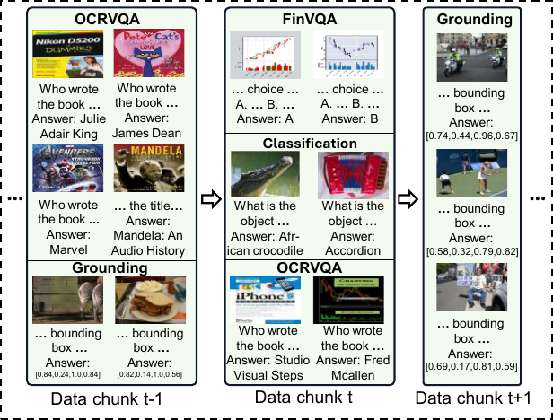

# StrLoRA: Towards Streaming Continual Visual Instruction Tuning for MLLMs

Streaming Continual Visual Instruction Tuning (StrCVIT) is a new and realistic continual learning setting for MLLMs that models data as a single-pass stream of interleaved and dynamically evolving tasks.

<p align="center">
  
</p>
<p align="center">
  <a href="https://huggingface.co/datasets/chanceche/StrCVIT_dataset">
    
  </a>
  <a href="https://github.com/chanceche/StrCVIT">
    
  </a>
</p>


## Install

1. Clone this repository and navigate to the StrCVIT folder.

```bash
git clone https://github.com/chanceche/StrCVIT.git
cd StrCVIT
```

2. Create the environment.

```bash
conda create -n strcvit python=3.10 -y
conda activate strcvit

pip install --upgrade pip
pip install -e ".[all]"
```


3. Set `PYTHONPATH`.

```bash
export PYTHONPATH="$PWD:${PYTHONPATH:-}"
```

## Dataset

The released StrCVIT instruction files are hosted on Hugging Face: [chanceche/StrCVIT_dataset](https://huggingface.co/datasets/chanceche/StrCVIT_dataset).

```text
https://huggingface.co/datasets/chanceche/StrCVIT_dataset
```

Download them into the repository root:

```bash
huggingface-cli download chanceche/StrCVIT_dataset \
  --repo-type dataset \
  --local-dir StrCVIT_dataset

export STRCVIT_DATASET_DIR="$PWD/StrCVIT_dataset"
```

The Hugging Face dataset repository contains:

```text
StrCVIT_dataset/
  train/
    data_001.json ... data_025.json
    record.json
  test/
    AD/
    ChartQA/
    Fin/
    GQA/
    Grounding/
    ImageNet/
    OCRVQA/
    Places365/
    RS/
    TextCaps/
    VQAv2/
  manifest.json
```

The instruction files do not include raw images. Download the raw image datasets listed below, organize them under a single image root, and set:

```bash
export STRCVIT_IMAGE_ROOT=/path/to/raw_images
```

All released JSON files use `<STRCVIT_IMAGE_ROOT>` as a placeholder for image paths.

### Raw Image Downloads

| Dataset | Expected image path under `<STRCVIT_IMAGE_ROOT>` | Download links |
| --- | --- | --- |
| AD / DriveLM | `AD/images/drivelm/stitch/` | [DriveLM Hugging Face](https://huggingface.co/datasets/OpenDriveLab-org/DriveLM), [DriveLM GitHub](https://github.com/OpenDriveLab/DriveLM) |
| COCO 2014 | `COCO2014/train2014/`, `COCO2014/val2014/` | [train2014](http://images.cocodataset.org/zips/train2014.zip), [val2014](http://images.cocodataset.org/zips/val2014.zip), [test2015](http://images.cocodataset.org/zips/test2015.zip) |
| VQAv2 | `COCO2014/val2014/` | [VQAv2 download page](https://visualqa.org/download.html), [COCO val2014](http://images.cocodataset.org/zips/val2014.zip) |
| Grounding / RefCOCO-style | `COCO2014/train2014/` | [COCO train2014](http://images.cocodataset.org/zips/train2014.zip), [RefCOCO](https://bvisionweb1.cs.unc.edu/licheng/referit/data/refcoco.zip), [RefCOCO+](https://bvisionweb1.cs.unc.edu/licheng/referit/data/refcoco+.zip), [RefCOCOg](https://bvisionweb1.cs.unc.edu/licheng/referit/data/refcocog.zip) |
| GQA | `GQA/images/` | [GQA images.zip](https://downloads.cs.stanford.edu/nlp/data/gqa/images.zip), [GQA download page](https://cs.stanford.edu/people/dorarad/gqa/download.html) |
| ImageNet / ILSVRC2012 | `ImageNet_withlabel/val/`, `ImageNet_withlabel/train/` | [ImageNet ILSVRC2012 download page](https://www.image-net.org/challenges/LSVRC/2012/) |
| Places365 | `Places/val_256/`, `Places/train_256/` | [train_256_places365standard.tar](http://data.csail.mit.edu/places/places365/train_256_places365standard.tar), [val_256.tar](http://data.csail.mit.edu/places/places365/val_256.tar), [filelist](http://data.csail.mit.edu/places/places365/filelist_places365-standard.tar) |
| RSVQA-HR / Remote Sensing VQA | `RS/images/` | [RSVQA website](https://rsvqa.sylvainlobry.com/#dataset) |
| FinVis / financial charts | `Fin/images/train/`, `Fin/images/test/` | [FinVis Hugging Face](https://huggingface.co/datasets/wza/FinVis), [FinVis-GPT GitHub](https://github.com/wwwadx/FinVis-GPT) |
| OCR-VQA | `OCR-VQA/images/` | [OCR-VQA website](https://ocr-vqa.github.io/), [OCR-VQA images](https://drive.google.com/drive/folders/1_GYPY5UkUy7HIcR0zq3ZCFgeZN7BAfm_) |
| TextCaps | `Textcaps/` | [train/val images](https://dl.fbaipublicfiles.com/textvqa/images/train_val_images.zip), [test images](https://dl.fbaipublicfiles.com/textvqa/images/test_images.zip), [TextCaps page](https://textvqa.org/textcaps/) |
| ChartQA | `ChartQA/train/`, `ChartQA/test/` | [HuggingFaceM4/ChartQA](https://huggingface.co/datasets/HuggingFaceM4/ChartQA), [ChartQA GitHub](https://github.com/vis-nlp/ChartQA) |

## Model Preparation

Download the base models before running training:

- [OpenGVLab/InternVL3_5-8B-Pretrained](https://huggingface.co/OpenGVLab/InternVL3_5-8B-Pretrained)
- [OpenGVLab/InternVL3_5-4B-Pretrained](https://huggingface.co/OpenGVLab/InternVL3_5-4B-Pretrained)
- [google/gemma-3-4b-pt](https://huggingface.co/google/gemma-3-4b-pt)

```bash
export MODEL_ROOT=/path/to/models
```

Configure local placeholders before running scripts:

- `<MODEL_ROOT>`: base model directory
- `<STRCVIT_DATASET_DIR>`: released StrCVIT JSON directory
- `<STRCVIT_IMAGE_ROOT>`: image root for the original datasets
- `<STRCVIT_METHODS_DIR>`: this repository directory
- `<CUDA_HOME>`: CUDA toolkit directory used by DeepSpeed; `scripts/configure_paths.py` detects it automatically from the installed `nvidia-cuda-nvcc` package

```bash
python scripts/configure_paths.py
```

## Training

Run LoRA fine-tuning baselines:

```bash
bash scripts/Train_intervl/internvl3_5_8b_LoRA/train_all.sh
bash scripts/Train_intervl/internvl3_5_4b_LoRA/train_all.sh
bash scripts/Train_Gemma/LoRA/train_all.sh
```

Run MoELoRA baselines:

```bash
bash scripts/Train_intervl/internvl3_5_8b_MoELoRA/train_all.sh
bash scripts/Train_intervl/internvl3_5_4b_MoELoRA/train_all.sh
bash scripts/Train_Gemma/MoELoRA/train_all.sh
```

Run EWC baselines:

```bash
bash scripts/Train_intervl/internvl3_5_8b_EWC/train_all.sh
bash scripts/Train_intervl/internvl3_5_4b_EWC/train_all.sh
bash scripts/Train_Gemma/EWC/train_all.sh
```

Run the SMoLoRA baseline:

```bash
bash scripts/Train_intervl/internvl3_5_8b_SMoLoRA/train_all.sh
bash scripts/Train_intervl/internvl3_5_4b_SMoLoRA/train_all.sh
bash scripts/Train_Gemma/SMoLoRA/train_all.sh
```

Run the main continual StrLoRA experiments:

```bash
bash scripts/Train_intervl/internvl3_5_8b_StrLoRA/train_all.sh
bash scripts/Train_intervl/internvl3_5_4b_StrLoRA/train_all.sh
bash scripts/Train_Gemma/StrLoRA/train_all.sh
```

The aggregate scripts iterate from `data_001` to `data_025`. The first task uses `train_start.sh`; later tasks use `train_strcvit.sh` and load the previous task checkpoint.

## Evaluation

Evaluation is called automatically after each task by the aggregate training scripts. Standalone evaluation scripts are provided under:

```text
scripts/Eval_internvl_proxy/
scripts/Eval_Gemma_proxy/
```

Training checkpoints are written under:

```text
<STRCVIT_METHODS_DIR>/checkpoints/StrCVIT/data_001/
...
<STRCVIT_METHODS_DIR>/checkpoints/StrCVIT/data_025/
```

Evaluation outputs are written under:

```text
<STRCVIT_METHODS_DIR>/results/StrCVIT/
```


## License

- Code: Apache License 2.0, see [LICENSE](LICENSE).
- Released StrCVIT instruction files: CC BY-NC 4.0, see the Hugging Face dataset repository.
- Raw images, original annotations, and base model weights are not included and remain governed by their original dataset/model licenses and access terms.

## Acknowledgement

This repository adapts the training framework code from [ms-swift](https://github.com/modelscope/ms-swift) and builds on [Hugging Face PEFT](https://github.com/huggingface/peft) and the public model/dataset resources listed above. We thank the authors and maintainers for their contributions.
